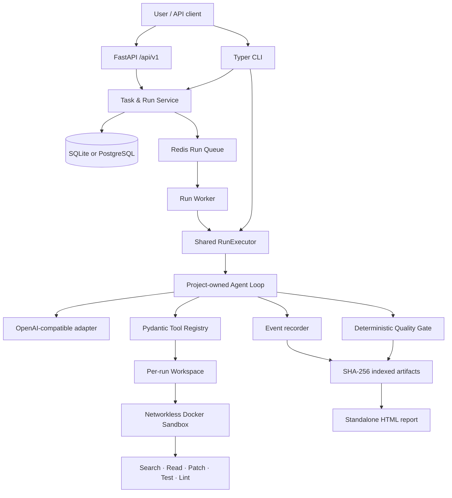
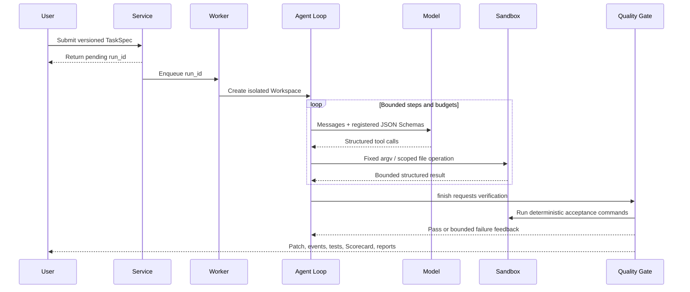
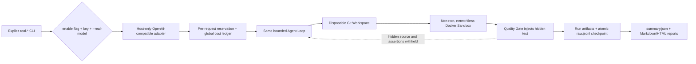

# PatchPilot architecture

PatchPilot is a modular monolith: the CLI, FastAPI process, and Redis Worker share the same
`RunService`, `RunExecutor`, project-owned Agent Loop, tool registry, Quality Gate, and artifact
store. There is no second execution implementation hidden behind the API.

## Run sequence

## Real Benchmark v1 execution

The benchmark copies a curated repository snapshot and creates a deterministic baseline commit;
the committed snapshot itself is hash-checked before and after every fixture audit. Model calls run
only on the host. The API key and Authorization header are never placed in the Workspace, Docker
environment, event stream, reports, or command arguments. Each formal task receives the same
bounded repository snapshot, model, prompt version, temperature, and task budget under all four
strategies; only the documented policy capabilities differ.

## Trust boundaries

- Model output is untrusted. It can select only registered tools with validated Pydantic inputs.
- Every file operation resolves the target below the per-run Workspace and rejects traversal,
  denied paths, and escaping symbolic links.
- Commands are application-owned argv arrays. PatchPilot never uses `shell=True` for repository
  execution.
- Unknown code runs in a non-root Docker container with no network, a read-only root filesystem,
  bounded CPU/memory/PIDs, and no Docker socket or model credential.
- The model API call happens in the host Worker. `MODEL_API_KEY` is excluded from Workspace and
  sandbox environments and is never stored in events.
- A model `finish` call is only a request. Deterministic code assigns the final result after scope,
  patch-budget, acceptance-test, required-test, and runtime-budget checks.

## Persistence and artifacts

SQLite supports local CLI work. PostgreSQL plus Redis supports asynchronous service mode. Event
rows contain bounded metadata; large outputs stay in run-scoped artifacts. Patch, JSONL events,
test log, Scorecard, Markdown report, and HTML report are atomically written and indexed by byte
size and SHA-256.
